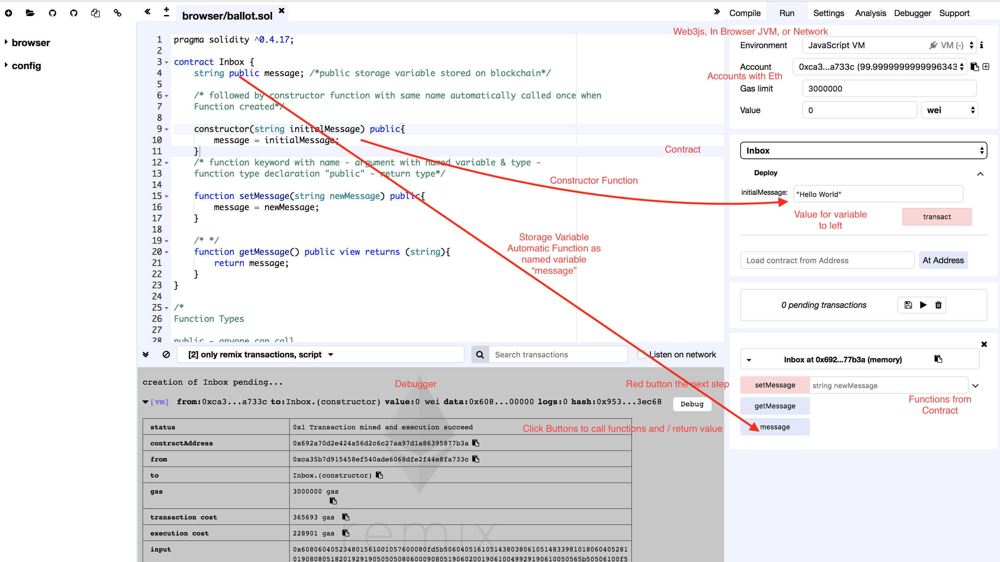

# Services, Tools, Utilities, etc

## Block Explorers

- [EtherScan](https://etherscan.io/)
- [EthStats](https://ethstats.io/)

## Managed Blockchains

- [Amazon Managed Blockchain](https://aws.amazon.com/managed-blockchain/)
- [Azure Managed Blockchain](https://azure.microsoft.com/en-us/solutions/blockchain/)
- [Chain](https://chain.com/)
- [IBM Blockchain](https://www.ibm.com/blockchain)
- [Kaleido](https://kaleido.io/)
- [Oracle Blockchain Platform](https://www.oracle.com/cloud/blockchain/)

## Identity

- [Ion](https://github.com/decentralized-identity/ion/)
- [uPort](https://www.uport.me/)
- [W3C DIDs spec](https://w3c-ccg.github.io/did-spec/)

## Utilities

- [EthOn](https://ethon.consensys.net/)
- [Tenderly](https://tenderly.dev/)
- [truffle-plugin-verify](https://github.com/rkalis/truffle-plugin-verify#readme)
- [Remix UI](http://remix.ethereum.org/#optimize=false&version=soljson-v0.5.1+commit.c8a2cb62.js)

## Wallets

- [Fortmatic](https://fortmatic.com/)
- [Hedgehog](https://hedgehog.audius.co)
- [Ledger](https://www.ledger.com/)
- [MetaMask](https://metamask.io)

## Private Computation Protocols
- [Oasis](https://www.oasislabs.com/)
- [Enigma](https://enigma.co/)

## Private Transaction Protocols
- [Aztec](https://www.aztecprotocol.com/)
- [Nightfall](https://github.com/EYBlockchain/nightfall)